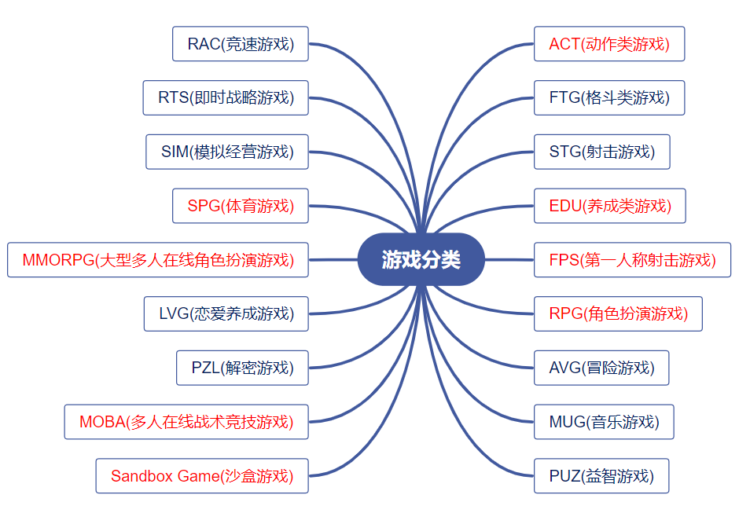
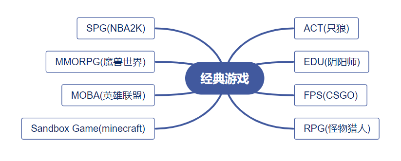

# 
一、游戏的本质

## 
homework01

#### 
18342002 蔡高飞

## Part 1：使用思维导图描述游戏的分类
### 游戏分类

* 上述游戏分类较为宽泛，不少类别仍可以细分，如RPG下还可以分出ARPG等；
   

## Part 2：结合手机游戏市场的下载量与排名等数据，结合游戏分类图，描述游戏市场的热点
&emsp;&emsp;在2020.9.19这一天，借助于app store上的汇总，可以看到免费游戏中，《阴阳师：妖怪屋》、《和平精英》以及《王者荣耀》三款游戏占据前三。
&emsp;&emsp;以上三款游戏，《阴阳师：妖怪屋》是一个**休闲养成**游戏，《和平精英》则综合了第三人称**射击**以及**大逃杀**，《王者荣耀》就是手机端的**moba**游戏。
&emsp;&emsp;再综合其他的一些其他排行榜上的游戏来看，我认为 **Part 1** 中**红字**标识的游戏类别是当下较为热门的游戏设计方向，其中部分类别受到3A大作的游戏厂商所青睐(如ACT、FPS、SPG)，有些类别在手游市场中大放光彩(如EDU、MOBA)，而有些类别借助互联网而被玩家所钟爱(如RPG、MMORPG、MOBA、Sandbox Game)。
 

### 各热门游戏类型中的经典游戏
&emsp;&emsp;以下是上述热门游戏类别中比较**经典且广为人知**的一些**PC端**游戏：

  
