# <center>离散仿真引擎基础</center>
## <center>homework 02</center>
#### <center>18342002 蔡高飞</center>
## 一.简答题
#### 1. 解释 游戏对象（GameObjects） 和 资源（Assets）的区别与联系。
解答：
&emsp;&emsp;游戏对象：所有在场景中出现的物体都是一个游戏对象；
&emsp;&emsp;资源：所有游戏中需要使用到的素材，包括了游戏对象、图像、音频、脚本、场景等；
&emsp;&emsp;联系：游戏对象可以加入到资源当中，即预制；而资源中的预制则可以实例化为一个游戏对象，或者附加在一个游戏对象上作为其属性；
<br><br>

#### 2. 下载几个游戏案例，分别总结资源、对象组织的结构（指资源的目录组织结构与游戏对象树的层次结构）
解答：
&emsp;&emsp;资源的目录组织结构：包含了预制、脚本、材料、场景等，以及外部可能加入的图片、音频、动画等文件；
<center>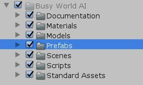</center>
<br><br><br><br><br>

&emsp;&emsp;游戏对象的层次结构：游戏对象层次就是一棵树，在一个游戏场景下会有多个游戏对象，而一个游戏对象下又可以有多个子对象，以此类推。
<center>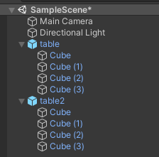</center><br><br>

#### 3. 编写一个代码，使用 debug 语句来验证 MonoBehaviour 基本行为或事件触发的条件
* 基本行为包括 Awake() Start() Update() FixedUpdate() LateUpdate()
* 常用事件包括 OnGUI() OnDisable() OnEnable()

解答：
&emsp;&emsp;代码如下：

```C#
using System.Collections;
using System.Collections.Generic;
using UnityEngine;

public class testBehavior : MonoBehaviour
{
    // Start is called before the first frame update
    void Start()
    {
         Debug.Log("Start");
    }

    void Awake()
    {
        Debug.Log("Awake");
    }
    // Update is called once per frame
    void Update()
    {
        Debug.Log("Update");
    }
```
```C#
    void FixedUpdate()
    {
        Debug.Log("FixedUpdate");
    }

    void LateUpdate()
    {
        Debug.Log("LateUpdate");
    }

    void OnGUI()
    {
        Debug.Log("OnGUI");
    }

    void OnDisable()
    {
        Debug.Log("OnDisable");
    }

    void OnEnable()
    {
        Debug.Log("OnEnable");
    }
}
```
&emsp;&emsp;运行结果：
<center>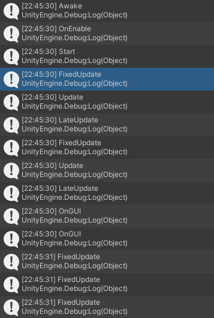</center>
<center>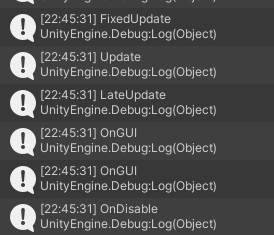</center>

&emsp;&emsp;解释:
* Awake()：当脚本装载入游戏对象并被对象运行时调用一次，是最先被调用的函数；
* Start()：在开始执行update()之前调用，常用于初始化；
* FixedUpdate()：每一个时间片都会被调用一次；
* Update()：每一帧会被调用一次，一帧有可能会占用几个时间片；
* LateUpdate()：当update()完成后被调用一次，可在更新后调整其他的游戏对象，如摄像机；
* OnGUI()：引擎每一次绘制图像时调用一次；
* OnDisable()：当脚本变为非激活或游戏对象不可用时调用；
* OnEnable()：当脚本被激活或游戏对象重新设为可用时调用；
<br><br>

#### 4. 查找脚本手册，了解 GameObject，Transform，Component 对象
**4.1 分别翻译官方对三个对象的描述（Description）**
&emsp;&emsp;**游戏对象**：游戏对象是 Unity 中的**基础对象**，表示角色、道具和景物。它们本身并没有取得多大作为，但它们充当**组件的容器**，而组件可实现真正的功能，是Unity场景里面所有实体的**基类**；
&emsp;&emsp;**变换组件**：Transform 组件确定每个对象在场景中的 **Position、Rotation 和 Scale** 属性的值。每个游戏对象都有一个变换组件；
&emsp;&emsp;**组件**：组件是游戏中对象和行为的**基本要素**，它们是每个游戏对象的**功能单元**，是附加到游戏物体的基类。
<br><br><br><br><br><br><br><br>

**4.2描述下图中 table 对象（实体）的属性、table 的 Transform 的属性、 table 的部件**
* 本题目要求是把可视化图形编程界面与 Unity API 对应起来，当你在 Inspector 面板上每一个内容，应该知道对应 API。
* 例如：table 的对象是 GameObject，第一个选择框是 activeSelf 属性。

解答：
&emsp;&emsp;图片如下：
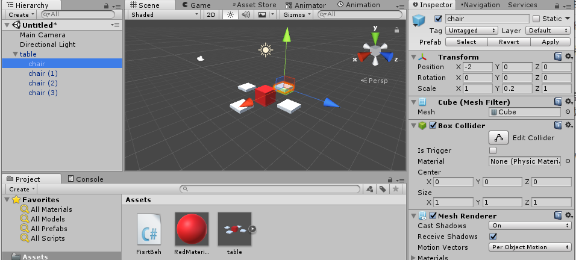

table的属性
* activeSelf
* Mesh Filter
* Mesh Renderer
* Transform
* Box Collider
* Add Component

Transform的属性：
* 对象位置；
* 对象角度；
* 对象大小；

table的部件
* activeSelf：可定义对象名称、动静态、标签、层次等属性；
* Transform：可定义对象的位置、角度以及大小；
* Box Collider：可调整坐标系的中心位置与大小；
* Add Component：给对象增加组件，如添加脚本；

**4.3 用 UML 图描述 三者的关系（请使用 UMLet 14.1.1 stand-alone版本出图）**
&emsp;&emsp;UML图如下：
<center>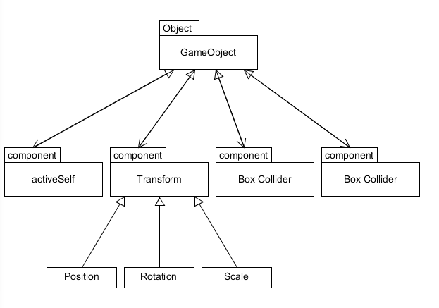</center>
<br><br>

#### 5. 资源预设（Prefabs）与 对象克隆 (clone)
**5.1 预设（Prefabs）有什么好处？**
解答：
&emsp;&emsp;预设可以提前将多个游戏对象合为一组对象，并可像标准游戏对象一样使用，即可以快速地实例化大量相同的一组对象，且要修改所有实例化对象时，只需要修改预设，而不用一一修改；

**5.2 预设与对象克隆 (clone or copy or Instantiate of Unity Object) 关系？**
解答：
&emsp;&emsp;预设实例化出的对象共享了预设的属性，若预设被修改，则所有实例化对象都会被修改；对象克隆出的新对象并不共享原对象的属性，是一个独立于原对象的个体，因此修改原对象属性并不会影响新对象。

**5.3 制作 table 预制，写一段代码将 table 预制资源实例化成游戏对象**
解答：
&emsp;&emsp;实例化table：
<center>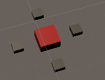</center>
将table设为预设：
<center>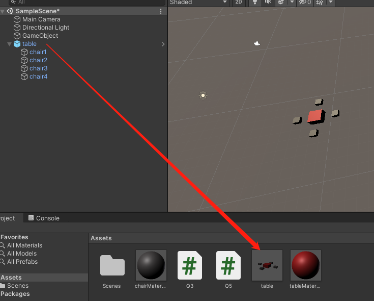</center>
<br><br><br><br><br>
代码实例化table如下：

```C#
using System.Collections;
using System.Collections.Generic;
using UnityEngine;

public class Q5 : MonoBehaviour
{
    public Transform table;
    // Start is called before the first frame update
    void Start()
    {
        GameObject t1 = Instantiate<Transform> (table, this.transform).gameObject;
		t1.transform.position = new Vector3 (0, 0, 0);
    }
}

```

## 二、编程实践：小游戏井字棋
#### 1.创建 TicTacToeChess.cs 脚本文件
<center>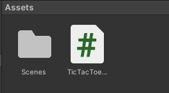</center>

#### 2.编写代码，代码详见第5步

#### 3.将脚本文件装载在 空对象(GameObject) 上
<center>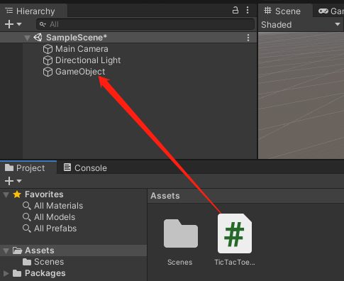</center>

#### 4.运行结果
<center>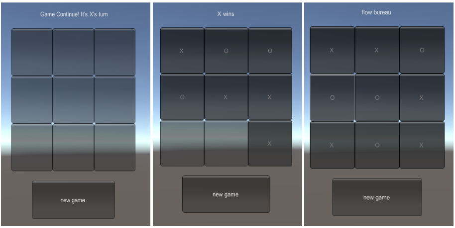</center>

#### 5.代码
```C#
using System.Collections;
using System.Collections.Generic;
using UnityEngine;

public class TicTacToeChess : MonoBehaviour
{
    // turn == 1: X;         turn == 2: O;
    private int counter = 0;
    private int turn = 1;
    private int [,]state = new int[3,3];

    private void newGame(){
        counter = 0;
        turn = 1;
        for(int i=0;i<3;i++)
            for(int j=0;j<3;j++)
                state[i,j] = 0;
    }
```
```C#
    // return == -1: no one wins, game continue;
    // return == 0: flow bureau;
    // return == 1: X wins;
    // return == 2: O wins;
    private int isOver(){
        // test second row and col, and two slash
        int center = state[1,1];
        if(center != 0){
            // two slash
            if((center == state[0,0] && center == state[2,2])||(center == state[0,2] && center == state[2,0]))
                return center;
            // row and col
            if((center == state[1,0] && center == state[1,2])||(center == state[0,1] && center == state[2,1]))
                return center;
        }
        
        // test first row and col
        int first = state[0,0];
        if(first != 0){
            if((first == state[1,0] && first == state[2,0])||(first == state[0,1] && first == state[0,2]))
                return first;
        }

        // test third row and col
        int last = state[2,2];
        if(last != 0){
            if((last == state[0,2] && last == state[1,2])||(last == state[2,0] && last == state[2,1]))
                return last;
        }
        
        // flow bureau
        if(counter >= 9)
            return 0;
        else
            return -1;
    }

    // Start is called before the first frame update
    void Start()
    {
        newGame();
    }

    void OnGUI()
    {
        if(GUI.Button(new Rect(350,400,200,80), "new game"))
		{
			newGame();
		}

		int gameState = isOver();

        // output the game state: continue or someone wins or flow bureau
		if (gameState == 1) {
			GUI.Label (new Rect (430, 40, 100, 50), "X wins");
		} 
		else if (gameState == 2) {
			GUI.Label (new Rect (430, 40, 100, 50), "O wins");
		} 
		else if (gameState == 0) {
			GUI.Label (new Rect (415, 40, 100, 50), "flow bureau");
		} 
		else {
			if (turn == 1) {
				GUI.Label (new Rect (370, 40, 200, 80), "Game Continue! It's X's turn");
			}
			else if (turn == 2) {
				GUI.Label (new Rect (370, 40, 200, 80), "Game Continue! It's O's turn");
			}
		}

        // print the button
		for(int i = 0; i < 3; i++)
		{
			for(int j = 0; j < 3; j++)
			{
				if (state[i, j] == 1)
                    GUI.Button(new Rect(i * 100 + 300, j * 100 + 80, 100, 100), "X");
				else if (state[i, j] == 2)
                    GUI.Button(new Rect(i * 100 + 300, j * 100 + 80, 100, 100), "O");
				if(GUI.Button(new Rect(i * 100 + 300, j * 100 + 80, 100, 100), "")){
                    // only when game continues, we can update the button and state
                    if(gameState == -1)
					{
						if (turn == 1){
                            state[i, j] = 1;
                            turn = 2;
                        }
                        else if (turn == 2){
                            state[i, j] = 2;
                            turn = 1;
                        }
                        counter++;
					}
                }
			}
		}
    }
}
```